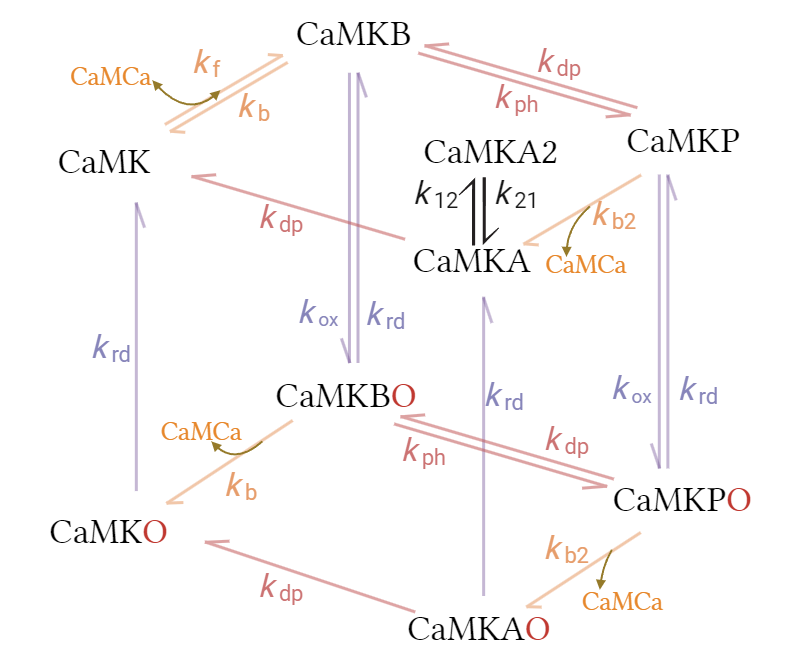

# CaMKII cardiomyocyte model

Improved version from [Wu's integrative NRVM CaMKII model](https://github.com/ntumitolab/Hopkins-CaMKII).

---

[Chang(2019)]:  https://doi.org/10.1038/s41467-019-10694-z
[Christensen(2019)]: https://doi.org/10.1371/journal.pcbi.1000583
[Moritti(2014)]: https://doi.org/10.1113/jphysiol.2013.266676
[Korhonen(2009)]: https://pmc.ncbi.nlm.nih.gov/articles/PMC2716686/

- CaMKII model: "Mechanisms of Ca2+/calmodulin-dependent kinase II activation in single dendritic spines" (Chang et al., 2019, Nature Communications); [Chang(2019)][]
- ROS activation model: Oxidized Calmodulin Kinase II Regulates Conduction Following Myocardial Infarction: A Computational Analysis (Christensen et al. 2009); [Christensen(2019)][]
- Isoproterenol and CaMKII effects: A novel computational model of mouse myocyte electrophysiology to assess the synergy between Na+ loading and CaMKII. (Moritti et al. 2014); [Moritti(2014)][]
- Neonatal rat ventricular myocyte (NRVM) model: Model of Excitation-Contraction Coupling of Rat Neonatal Ventricular Myocytes (Korhonen et al. 2009); [Korhonen(2009)][]

## Adjusted from the original models

### Beta-adrenergic system

The activities of PKACI, PKACII, PP1, and their downstream targets (SERCA, LCC, RyR, and NCX) are described by Hill functions, fitted to the activities in the original beta-adrenergic system in [Moritti(2014)][] across a range of isoproterenol.

### CaMKII system

- Association/dissociation rates of CaMKII and CaM-calcium (kf, kb) is fitted to [Chang(2019)][] model across a range of cytosolic calcium concentrations.
- Autophosphorylation/dephosphorylation rates of CaMKII (kdp, kph) are adapted from [Chang(2019)][] model.
- Oxidation/reduction rates of CaMKII (kox, krd) are adapted from [Christensen(2019)][] model.

### Neonatal rat ventricular cardiomyocyte (NRVM)

- Caffeine activation of RyR: increasing sensitivity to Sub-SR Ca instead of constant opening.
- Compartment corrections for SR Ca and Sub-SR Ca ODEs.
- Fast sodium channel gating variable recovery rates increased by 3 times to accommodate 2Hz and 3Hz pacing.

## Benchmark

Conditions:

- 1Hz pacing from t=100 to 300 seconds
- TRBDF2 solver
- Relative and absolute tolerances: 1e-9
- CPU: i9-14900k
---

Results:

[Previous model](https://github.com/ntumitolab/Hopkins-CaMKII/blob/main/Neonatal%20Rat/Main%20CaMKII%20System/neonatal_camkii.jl): 160.5 sec
This model: 5.777 sec
